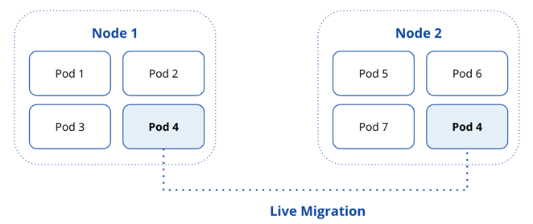
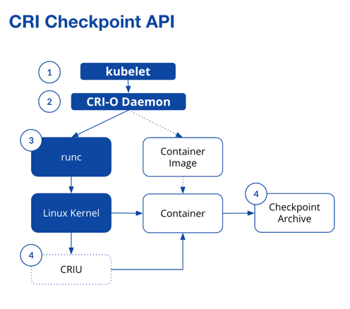

## **Live Pod Migration in Kubernetes**

### **What Are Containers?**
Modern applications run inside **containers**, which encapsulate software and its dependencies into a portable, consistent execution environment. Unlike virtual machines, containers share the host OS kernel, making them lightweight and efficient.

### **Why Kubernetes?**
Managing hundreds or thousands of containers manually is impractical. **Kubernetes** automates container deployment, scaling, and orchestration across clusters of machines. The fundamental unit in Kubernetes is a **Pod**, which groups containers that work together.

However, **Kubernetes does not support live pod migration**—relocating a running Pod from one node to another without downtime. This is a major limitation for **stateful workloads** such as AI inference, databases, and real-time analytics.

---

## **Why Does Live Pod Migration Matter?**
Currently, when a Pod must be moved due to **node failures, autoscaling, or resource rebalancing**, Kubernetes follows a **terminate-and-recreate** model:
- The existing Pod is **stopped**, losing all in-memory data and active network connections.
- A new Pod is created on another node, requiring applications to **restart from scratch**.

For **stateful applications**, this results in **downtime, performance degradation, and potential data loss**. Live migration would:

  

✔ Preserve **application state, network connections, and execution progress**.

✔ Enable **smoother autoscaling and resource optimization**.  

✔ Improve **fault tolerance without service interruption**.

---

## **How Kubernetes Handles Pod Movement Today**

### **Default Rescheduling** (Current Behavior)
- When a node fails, Kubernetes reschedules Pods on a new node.
- However, **in-memory state and connections are lost**.

### **Forensic Checkpointing** (Introduced in Kubernetes v1.25)

  

- Kubelet requests checkpointing through the CRI-O Daemon.
- `runc` and CRIU capture the container state (memory, CPU, open connections).
- A checkpoint archive is created, storing process snapshots for later analysis.
- Designed for debugging and forensic analysis, but lacks live recovery support.

### **Third-Party Solutions**
- Existing tools like **MyceDrive (DMTCP)** attempt live migration but require additional infrastructure.
- **Performance suffers in low-bandwidth environments.**

**No Kubernetes-native solution for live pod migration exists today.**  
Our research aims to close this gap.

---

## **Our Research: Building a Kubernetes-Native Live Migration System**
We analyzed **Kubernetes Enhancement Proposals (KEPs)** to understand how new features integrate with the ecosystem.

### **Key Components**
- **CRI-O (Container Runtime Interface):** Manages container execution.
- **CRIU (Checkpoint/Restore in Userspace):** Captures and restores process states.
- **CNI (Container Network Interface):** Preserves networking across migrations.
- **Kubelet (Node Agent):** Handles Pod lifecycle on nodes.

### **What We Built**
A **proof-of-concept** live migration system that:
- Uses **gRPC and CRI APIs** to capture and transfer running Pods.
- Preserves **process state, memory, and metadata** across nodes.
- Supports **multi-container Pods** without intrusive modifications in Kubernetes.

---

## **Next Steps & Research Directions**
We are currently improving:
- **Optimizing migration performance** in low-bandwidth environments.
- **Ensuring compatibility** with different Kubernetes versions and workloads.
- **Integrating with native Kubernetes APIs** for broader adoption.

Join the discussion and contribute to the project! 🚀
